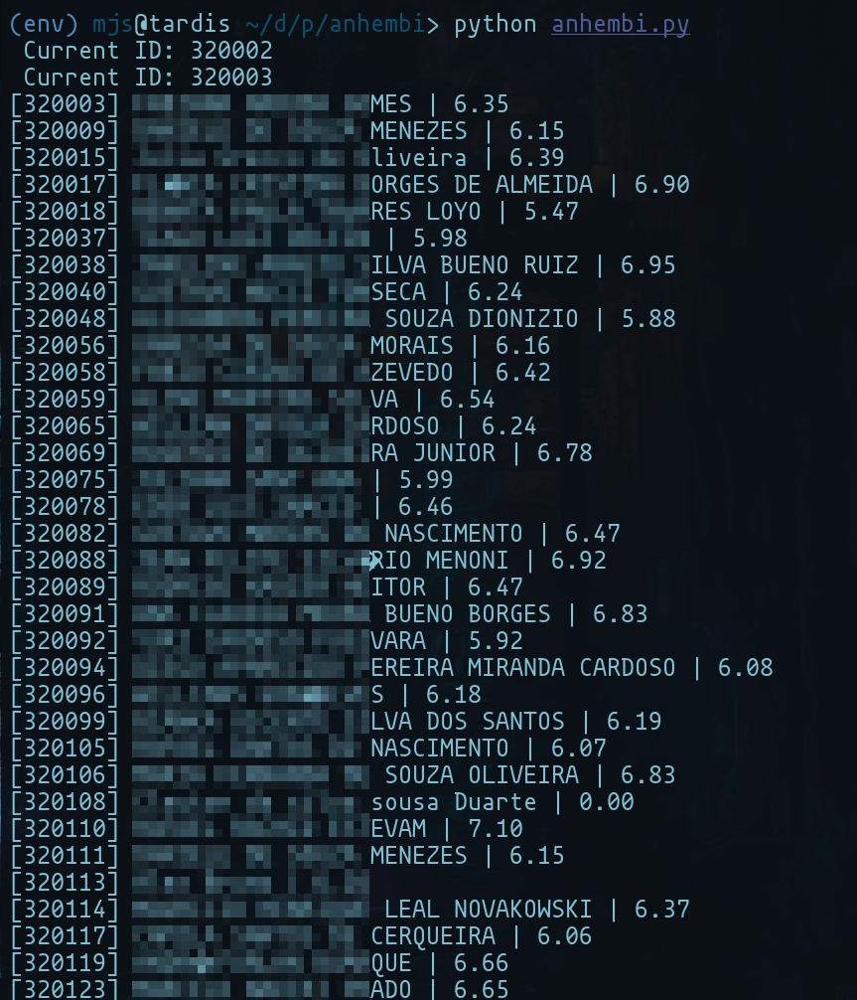

# Anhembi Notas 

Esse programa simplesmente mostra a nota que os alunos da universidade anhembi morumbi tiraram no vestibular, utilizando uma falha. 

 

como voce pode ver, a maioria das notas nao passa de 7 e raramente alguma chega a 10, ha tambem contas de teste que chegaram a valores maiores, mas nao de alunos reais. 

that's all folks!